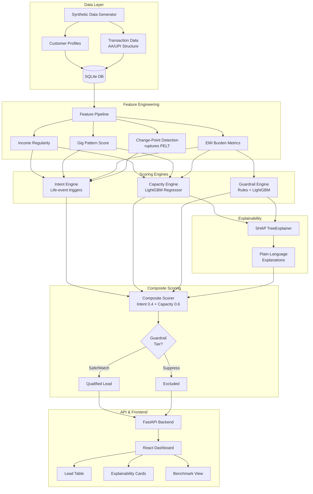

# CreditSetu — AI Lead Intelligence Engine for Retail Lending

> **IDBI Innovate 2026 Hackathon — Track 02**: Lead Generation, Behavioural Analytics, Retail Lending

CreditSetu is an AI-powered lead intelligence engine that identifies high-quality loan prospects from customer transaction data. It combines three scoring engines — **Intent Signal Detection**, **Behavioural Capacity Scoring**, and **Risk Guardrails** — to generate ranked, explainable leads for bank relationship managers. The system specifically targets thin-file and new-to-credit (NTC) segments that traditional bureau-based scoring cannot evaluate, using Account Aggregator-style transaction data to assess creditworthiness behaviorally.

---

## Architecture



---

## Quick Start

### Prerequisites
- Docker & Docker Compose

### Run Everything
```bash
docker-compose up --build
```

This single command will:
1. Build the backend (Python 3.11 + FastAPI)
2. Generate ~1000 synthetic customers with transactions
3. Train the ML models (Capacity + Guardrail engines)
4. Score all customers with SHAP explanations
5. Start the API server at **http://localhost:8000**
6. Build and serve the React dashboard at **http://localhost:5173**

### Manual Setup (without Docker)

#### Backend
```bash
cd backend
pip install -r requirements.txt
python scripts/seed_database.py
uvicorn app.main:app --reload --port 8000
```

#### Frontend
```bash
cd frontend
npm install
npm run dev
```

---

## What's Real vs. What's Synthetic

> **This section is critical for transparency.**

| Component | Status | Production Equivalent |
|---|---|---|
| **Transaction data** | 🟡 Synthetically generated | Account Aggregator (AA) FIP data via Sahamati-compliant APIs |
| **Customer profiles** | 🟡 Synthetic personas | IDBI Bank's customer database (CBS/CRM) |
| **Bureau scores** | 🟡 Randomly assigned (or null) | CIBIL/Experian/CRIF bureau API integration |
| **Feature engineering** | 🟢 Real algorithms | Same code, different data source |
| **ML models** | 🟢 Real LightGBM models | Same architecture, retrained on real data |
| **Change-point detection** | 🟢 Real ruptures PELT algorithm | Same algorithm on real transaction series |
| **SHAP explanations** | 🟢 Real SHAP TreeExplainer | Same explainability layer |
| **Scoring pipeline** | 🟢 Real end-to-end pipeline | Same pipeline with AA data ingestion |

The synthetic data generator produces structurally equivalent data to what an AA integration would provide — same schema, realistic Indian merchant names, UPI transaction patterns, EMI structures, and NACH bounce events. The ML models, feature engineering, and explainability layer are production-ready code running on synthetic data.

**In production**, the `data_generation/` module would be replaced by a data ingestion layer connected to IDBI Bank's Account Aggregator FIU integration (via Sahamati ecosystem). The rest of the codebase remains unchanged.

---

## Benchmarking

Run the benchmark suite to generate evaluation metrics:

```bash
# Inside the backend container or local env
python scripts/run_benchmark.py
```

Results are saved to:
- `data/benchmark_report.json` — machine-readable
- `data/benchmark_report.md` — human-readable

Access via API: `GET /api/benchmark/latest`

Or trigger via API: `POST /api/benchmark/run`

These are the exact numbers to use in the pitch deck's benchmarking slide.

---

## API Documentation

Interactive API docs (Swagger UI) are available at:

**http://localhost:8000/docs**

### Key Endpoints

| Method | Endpoint | Description |
|---|---|---|
| `GET` | `/api/leads` | Ranked, filterable lead list |
| `GET` | `/api/leads/stats` | Dashboard summary statistics |
| `GET` | `/api/customers` | Paginated customer list |
| `GET` | `/api/customers/{id}` | Full profile + transactions |
| `GET` | `/api/score/{id}` | Score breakdown + SHAP explainability |
| `POST` | `/api/data/generate` | Regenerate synthetic dataset |
| `POST` | `/api/benchmark/run` | Run benchmark evaluation |
| `GET` | `/api/benchmark/latest` | Latest benchmark report |

---

## Testing

```bash
cd backend
python -m pytest tests/ -v
```

Tests cover:
- Synthetic data generator persona distribution
- Engine score ranges and validity
- NTC/gig customers get valid scores (core value prop)
- Over-leveraged customers are correctly suppressed
- API endpoints return correct status codes and schemas

---

## Known Limitations

1. **Synthetic data only** — No real bank data is used. Evaluation metrics are computed against synthetic ground truth.
2. **Single-node SQLite** — Adequate for demo; production would use PostgreSQL with connection pooling.
3. **No real-time streaming** — Batch scoring only. Production would add Kafka/event-driven scoring for real-time triggers.
4. **Simplified NLG** — Template-based explanations. Could be enhanced with an LLM layer for more natural language.
5. **No authentication** — Open API for demo purposes. Production would require OAuth2/JWT.

---

## Future Development Roadmap

### Phase 2: Product Extensions
- **Home Loan / Mortgage**: Integrate EPFO (Employee Provident Fund) data for employment verification and tenure-based capacity scoring
- **Auto Loan**: Use vehicle registration + insurance data signals
- **GST Integration**: For self-employed/MSME capacity assessment using GST return data

### Phase 3: Production Enhancements
- Real Account Aggregator (AA) integration via Sahamati FIU certification
- Real-time event-driven scoring via Kafka consumer
- A/B testing framework for scoring weight optimization
- Feedback loop: track actual loan outcomes to retrain models
- Multi-language explanation support (Hindi, regional languages)
- PostgreSQL + Redis caching for production scale

---

## Tech Stack

| Layer | Technology |
|---|---|
| Backend | Python 3.11, FastAPI, SQLAlchemy, Pydantic v2 |
| Database | SQLite (PostgreSQL-ready via SQLAlchemy) |
| ML | scikit-learn, LightGBM, SHAP, ruptures |
| Frontend | React 18, Vite, TailwindCSS v3, Recharts |
| DevOps | Docker, Docker Compose |
| Testing | pytest, httpx |

---

## Project Structure

```
creditsetu/
├── README.md
├── docker-compose.yml
├── .env.example
├── backend/
│   ├── app/
│   │   ├── main.py                  # FastAPI entrypoint
│   │   ├── config.py                # Pydantic settings
│   │   ├── database.py              # SQLAlchemy engine
│   │   ├── models/                  # ORM models
│   │   ├── schemas/                 # Pydantic schemas
│   │   ├── data_generation/         # Synthetic data generators
│   │   ├── features/                # Feature engineering pipeline
│   │   ├── engines/                 # Intent, Capacity, Guardrail, Composite
│   │   ├── explainability/          # SHAP explainer
│   │   ├── api/                     # FastAPI routes
│   │   └── evaluation/              # Benchmark runner
│   ├── scripts/                     # seed_database.py, run_benchmark.py
│   ├── tests/                       # pytest test suite
│   ├── requirements.txt
│   └── Dockerfile
├── frontend/
│   ├── src/
│   │   ├── pages/                   # LeadDashboard, CustomerDetail, BenchmarkView
│   │   ├── components/              # Reusable UI components
│   │   ├── api/client.js            # Axios API client
│   │   ├── App.jsx                  # Root component with routing
│   │   └── main.jsx                 # Entry point
│   ├── package.json
│   ├── tailwind.config.js
│   └── Dockerfile
```

---

*Built for IDBI Innovate 2026 — Track 02: Lead Generation, Behavioural Analytics, Retail Lending*
