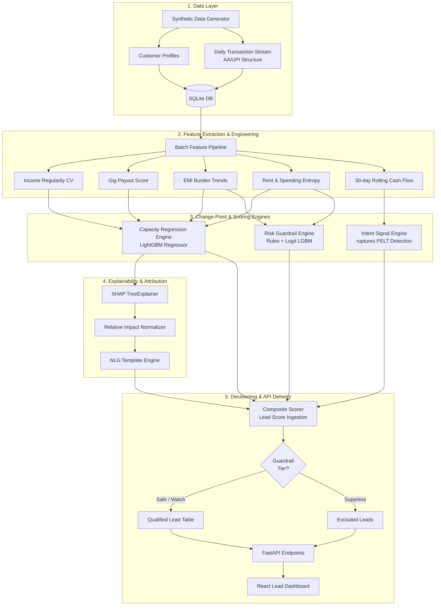

# CreditSetu — AI Lead Intelligence Engine for Retail Lending

[](https://www.idbi.bank)
[](#api-documentation)
[](#database-schema)
[](#tech-stack)
[](#tech-stack)

CreditSetu is an enterprise-grade AI lead intelligence engine designed to identify, rank, and explain high-quality retail lending prospects from customer transaction data. 

Targeting **Thin-File** and **New-To-Credit (NTC)** segments that traditional bureau-based scoring models cannot evaluate, CreditSetu leverages Account Aggregator-style behavioral streams to assess creditworthiness, detect real-time life-event triggers, estimate repayment capacity, and apply risk-mitigating guardrails.

---

## 📖 Table of Contents
1. [Core Features & Innovation](#-core-features--innovation)
2. [Detailed System Architecture](#%EF%B8%8F-detailed-system-architecture)
3. [Algorithmic & Mathematical Formulations](#-algorithmic--mathematical-formulations)
4. [Performance & Code Optimizations](#-performance--code-optimizations)
5. [Database Schema](#-database-schema)
6. [API Documentation](#-api-documentation)
7. [Model Benchmarking & Evaluation](#-model-benchmarking--evaluation)
8. [Quick Start & Setup](#-quick-start--setup)
9. [Project Directory Structure](#-project-directory-structure)
10. [Developer Guidelines](#-developer-guidelines)
11. [Disclaimer & Credits](#-disclaimer--credits)

---

## 🌟 Core Features & Innovation

*   **Behavioral Credit Assessment:** Evaluates customers using transactional activity (UPI spending entropy, rent consistency, NACH bounces, and income stability) instead of relying solely on bureau histories.
*   **Intent Signal Detection (ruptures PELT):** Uses change-point detection algorithms to recognize life events like **EMI closures** (capacity expansion) or **income step-ups** directly from raw transaction flows.
*   **Capacity Regression Modeling:** Estimates safe monthly repayment capacity using LightGBM regressors that natively handle missing values (perfect for thin files).
*   **Risk Guardrail Engine:** Combines hard compliance checks (NACH bounces, excessive active lenders) with a logit-based classifier to assign customers to **Safe**, **Watch**, or **Suppress** tiers.
*   **Explainable AI (SHAP attributions):** Translates complex LightGBM decision trees into natural language explanations using normalized relative percentage feature attributions.
*   **IDBI Bank Light Theme UI:** Fully styled to follow IDBI Bank branding (Deep Green, Teal, and Orange), featuring responsive Recharts visualizations, direct-page pagination inputs, and stable loading overlays.

---

## 🗺️ Detailed System Architecture



---

## 🔬 Algorithmic & Mathematical Formulations

### 1. Change-Point Detection (Ruptures PELT)
To capture intent triggers without training data labels, the Intent Engine runs change-point detection on a customer's net daily cash flow. 

Daily net flow $y_t$ is defined as credits minus debits on day $t$. To smooth monthly salary and rent spikes, the signal is smoothed with a 30-day rolling average:
$$s_t = \frac{1}{30} \sum_{i=0}^{29} y_{t-i}$$

The Pruned Exact Linear Time (PELT) algorithm minimizes the penalized cost function over partitions of the smoothed signal:
$$\min_{k, \tau} \sum_{i=0}^{k} \mathcal{C}(s_{\tau_i \dots \tau_{i+1}}) + \beta k$$
Where $\mathcal{C}$ is the Radial Basis Function (RBF) cost model, $k$ is the number of change-points, and $\beta = 1.5$ is the penalty weight. Detected breakpoints are then classified as:
*   **EMI Closure:** If a regular monthly EMI debit pattern disappears after the breakpoint.
*   **Income Step-Up:** If the mean of salary/gig payouts increases by $\ge 12\%$ after the breakpoint.
*   **New Commitment:** If a new regular monthly EMI debit is established.

### 2. Repayment Capacity Regressor
 Repayment capacity is predicted using a LightGBM Regressor. Standard credit models fail when CIBIL score is null. LightGBM handles missing values natively by routing null values down the optimal decision path determined during training.

### 3. Risk Guardrail Tiers
To prevent the model from generating binary $0/1$ probabilities, we inject training noise into the target variable $y_{\text{stressed}} \in \{0, 1\}$. The classifier learns a continuous logit probability:
$$P(\text{Stress} \mid X) = \frac{1}{1 + e^{-(\mathbf{w}^T \mathbf{x} + \epsilon)}}$$
Where $\epsilon \sim \mathcal{N}(0, \sigma^2)$ is Gaussian noise. This continuous risk score is mapped into three distinct operational tiers:
*   **Safe ($P < 0.35$):** Passed to the sales dashboard with standard processing.
*   **Watch ($0.35 \le P < 0.65$):** Passed but highlighted to credit analysts for closer review.
*   **Suppress ($P \ge 0.65$):** Excluded from the dashboard to protect the bank's asset quality.

### 4. Normalized SHAP Attributions
Standard SHAP values express feature influence in raw model output units (Rupees or Log-Odds). This squashes non-income features (like bounces) under massive salary numbers. 

We normalize SHAP values $\phi_i$ to express **relative percentage impact**:
$$\text{Relative Impact}_i = \frac{|\phi_i|}{\sum_{j} |\phi_j|} \times 100$$
This guarantees that behavioral signals (such as a single payment bounce or high active lender count) are visible to credit managers on the UI charts.

---

## ⚡ Performance & Code Optimizations

The pipeline is optimized to process **5,000 customers** with **3.87 Million transactions** in under **6 minutes**:

*   **Groupby Pre-indexing ($O(N)$ lookup):** Instead of scanning the entire 3.87M row transactions table inside the feature loop (which is $O(N \cdot M)$ and takes 15+ minutes), the pipeline groups the dataframe once by customer ID:
    ```python
    grouped_txns = {cust_id: group for cust_id, group in transactions_df.groupby("customer_id")}
    ```
    This reduced feature extraction time for 5,000 customers to **69.5 seconds**.
*   **Vectorized Net Flow:** Replaced row-wise `.apply()` lambda operations with vectorized `np.where` arrays inside the change-point detector:
    ```python
    txns_dated["signed_amount"] = np.where(txns_dated["type"] == "credit", txns_dated["amount"], -txns_dated["amount"])
    ```
*   **SQLAlchemy Bulk Insertion:** Changed individual row commits to database bulk inserts in batches of 50,000 records:
    ```python
    db.bulk_insert_mappings(Transaction, batch)
    ```
    This reduced database insert latency for 3.87M rows from ~1.5 hours to **79.6 seconds**.

---

## 🗄️ Database Schema

CreditSetu uses a single-file SQLite database. The schema is defined via SQLAlchemy ORM models:

### 1. `customers` Table
Stores customer demographic data, persona types, and ground-truth validation targets.

| Column Name | Data Type | Key/Index | Description |
|---|---|---|---|
| `customer_id` | `VARCHAR(20)` | Primary Key, Index | Unique customer ID (e.g. `CUST-00214`) |
| `name` | `VARCHAR(100)` | - | Full name |
| `age` | `INTEGER` | - | Age |
| `gender` | `VARCHAR(1)` | - | `M` or `F` |
| `occupation` | `VARCHAR(50)` | - | Profession/Industry |
| `persona_type` | `VARCHAR(30)` | - | Salaried Stable, Gig Worker, NTC, etc. |
| `bureau_score` | `FLOAT` (Nullable) | - | CIBIL credit score (null for NTC) |
| `monthly_income` | `FLOAT` | - | Aggregated monthly income |
| `emi_count` | `INTEGER` | - | Count of active loans |
| `total_emi` | `FLOAT` | - | Sum of monthly EMI debits |
| `true_repayment_capacity` | `FLOAT` | - | Ground truth capacity (validation only) |
| `life_events` | `TEXT` | - | JSON list of ground-truth events |

### 2. `transactions` Table
Stores daily transactional ledger entries matching the Account Aggregator deposit schema.

| Column Name | Data Type | Key/Index | Description |
|---|---|---|---|
| `id` | `INTEGER` | Primary Key | Auto-increment ID |
| `txn_id` | `VARCHAR(30)` | Unique, Index | Unique transaction transaction ID |
| `customer_id` | `VARCHAR(20)` | ForeignKey, Index | Link to `customers` table |
| `date` | `VARCHAR(20)` | - | Transaction date (ISO string) |
| `amount` | `FLOAT` | - | Transaction amount |
| `type` | `VARCHAR(10)` | - | `credit` or `debit` |
| `category` | `VARCHAR(50)` | - | salary, emi, rent, grocery, etc. |
| `counterparty` | `VARCHAR(100)` | - | UPI VPA, Bank VPA, or payroll source |
| `channel` | `VARCHAR(10)` | - | UPI, NEFT, RTGS, NACH |
| `narration` | `VARCHAR(200)` | - | Raw bank ledger text string |
| `is_bounce` | `BOOLEAN` | - | Flag indicating NACH debit return |

### 3. `scores` Table
Stores evaluation scoring output, risk categories, suggested products, and SHAP features.

| Column Name | Data Type | Key/Index | Description |
|---|---|---|---|
| `customer_id` | `VARCHAR(20)` | Primary Key, Index | Link to `customers` table |
| `intent_score` | `FLOAT` | - | Intent Engine raw score [0, 1] |
| `intent_event_type` | `VARCHAR(50)` | - | Detected change-point event category |
| `intent_event_recency_days` | `INTEGER` | - | Days since change-point occurred |
| `capacity_score` | `FLOAT` | - | Normalized capacity score [0, 1] |
| `capacity_amount` | `FLOAT` | - | Predicted safe monthly repayment capacity |
| `guardrail_score` | `FLOAT` | - | Logit risk probability [0, 1] |
| `guardrail_tier` | `VARCHAR(20)` | - | Safe, Watch, or Suppress |
| `composite_score` | `FLOAT` | - | Final combined lead score [0, 1] |
| `suggested_product` | `VARCHAR(50)` | - | Suggested product (Home Loan, CC, etc.) |
| `explanation` | `TEXT` | - | SHAP NLG-generated attribution sentence |
| `shap_contributions` | `TEXT` | - | JSON serialized list of relative SHAP values |

---

## 🔌 API Documentation

FastAPI exposes interactive Swagger docs at **`http://localhost:8000/docs`**.

### Key Endpoints

#### 1. `GET /api/leads`
Retrieves the ranked list of leads for the dashboard table. Supports filtering and pagination.
*   **Query Parameters:**
    *   `page`: Page index (default: `1`)
    *   `page_size`: Page limit (default: `20`)
    *   `min_score`: Filter by minimum composite score (default: `0.0`)
    *   `product_type`: Filter by product (e.g. `Micro-Credit Line`)
    *   `exclude_suppressed`: Hide over-leveraged leads (default: `true`)
*   **Sample Response:**
    ```json
    {
      "leads": [
        {
          "customer_id": "CUST-03085",
          "name": "Dhruv Reddy",
          "age": 34,
          "occupation": "Software Engineer",
          "persona_type": "salaried_stable",
          "city": "Mumbai",
          "bureau_score": 712.0,
          "composite_score": 0.88,
          "intent_score": 0.90,
          "capacity_score": 0.85,
          "guardrail_tier": "Safe",
          "is_qualified_lead": true,
          "suggested_product": "Home Loan",
          "explanation": "Score driven by high income regularity and stable monthly surplus."
        }
      ],
      "total": 2745,
      "page": 1,
      "page_size": 20
    }
    ```

#### 2. `GET /api/score/{customer_id}`
Retrieves the score breakdown and normalized SHAP attributions for a single customer.
*   **Sample Response:**
    ```json
    {
      "customer_id": "CUST-02144",
      "composite_score": 0.88,
      "intent_score": 0.73,
      "intent_event_type": "emi_closure",
      "intent_event_recency_days": 14,
      "capacity_score": 0.99,
      "capacity_amount": 49717.0,
      "guardrail_score": 0.12,
      "guardrail_tier": "Safe",
      "suggested_product": "Home Loan",
      "explanation": "Score driven by Monthly Income (+67%), Active Lenders (+13%), and Income Stability (+7%). Recent EMI closure detected 14 days ago.",
      "shap_contributions": [
        { "feature": "income_mean", "display_name": "Monthly Income", "value": 154769.0, "contribution": 67.71 },
        { "feature": "concurrent_lender_count", "display_name": "Active Lenders", "value": 1.0, "contribution": 13.46 },
        { "feature": "income_cv", "display_name": "Income Stability", "value": 0.035, "contribution": 7.49 },
        { "feature": "bureau_score", "display_name": "Bureau Score", "value": null, "contribution": -0.71 }
      ]
    }
    ```

---

## 📊 Model Benchmarking & Evaluation

To ensure unbiased evaluation, the benchmark runner evaluates models on a **fresh test dataset** (1,000 customers, ~770,000 transactions) that is separate from the operational database.

To execute the evaluations:
```bash
cd backend
python scripts/run_benchmark.py --n_customers 1000
```

### Evaluation Metrics Summary

*   **Capacity Scoring Model:**
    *   **AUC-ROC:** `0.9918` (evaluating capacity threshold at median)
    *   **RMSE:** `₹2,967` (Root Mean Squared Error of repayment capacity prediction)
    *   **$R^2$ Variance:** `0.9279` (Coeff. of determination indicating variance explained)
*   **Risk Guardrail Model:**
    *   **AUC-ROC:** `0.7962` (discrimination between stressed and safe customers)
    *   **False Positive Rate (FPR):** `11.51%` (safe customers incorrectly suppressed)
    *   **False Negative Rate (FNR):** `34.43%` (stressed customers incorrectly passed)
*   **Intent Signal Model:**
    *   **Precision:** `0.3394` (accuracy of change-point classifications)
    *   **Recall:** `0.4526` (share of actual events captured by PELT)
*   **Composite Scoring Pipeline:**
    *   **Precision @ Top 20%:** `0.995` (percentage of top-ranked leads that are valid)
    *   **Avg scoring latency:** `21.19 ms` per customer record.

---

## 🚀 Quick Start & Setup

### Option 1: Docker Compose (Recommended)
This runs the entire stack in isolated Docker containers:

```bash
# Clone the repository
git clone https://github.com/adarshcod30/CreditSetu.git
cd CreditSetu

# Spin up services
docker-compose up --build
```
This single command:
1. Builds the backend and frontend containers.
2. Seeds SQLite with 5,000 customers.
3. Trains the LightGBM models.
4. Serves the API at **`http://localhost:8000`** and the Dashboard at **`http://localhost:5173`**.

### Option 2: Local Manual Setup

#### 1. Backend Setup
```bash
cd backend

# Create virtual environment
python3 -m venv .venv
source .venv/bin/activate

# Install dependencies
pip install -r requirements.txt

# Run seeding script (generates data, trains models, scores database)
python scripts/seed_database.py --n_customers 5000

# Start backend server
uvicorn app.main:app --port 8000 --reload
```

#### 2. Frontend Setup
```bash
cd frontend

# Install node dependencies
npm install

# Start Vite dev server
npm run dev
```
Open **`http://localhost:5173`** in your browser.

---

## 📂 Project Directory Structure

```
CreditSetu/
├── README.md
├── docker-compose.yml
├── .env.example
├── .gitignore
├── backend/
│   ├── Dockerfile
│   ├── requirements.txt
│   ├── scripts/
│   │   ├── seed_database.py         # DB seeding script
│   │   └── run_benchmark.py         # Benchmarks evaluator
│   ├── app/
│   │   ├── main.py                  # FastAPI server entry point
│   │   ├── database.py              # SQLite connection config
│   │   ├── config.py                # Environment configuration settings
│   │   ├── models/                  # SQLAlchemy ORM models
│   │   ├── schemas/                 # Pydantic v2 schemas
│   │   ├── data_generation/         # Synthetic customer/transaction generators
│   │   ├── features/                # Feature engineering and change-point detectors
│   │   ├── engines/                 # Scorer logic (Intent, Capacity, Guardrail)
│   │   ├── explainability/          # SHAP attribution calculations
│   │   └── api/                     # FastAPI route files
│   └── tests/                       # Pytest unit tests
└── frontend/
    ├── Dockerfile
    ├── package.json
    ├── tailwind.config.js
    ├── index.html
    └── src/
        ├── App.jsx                  # Main app navigation & structure
        ├── index.css                # Global design system variables
        ├── pages/
        │   ├── LeadDashboard.jsx    # Leads page with Pie/Bar aggregate charts
        │   ├── CustomerDetail.jsx   # Profile page with SHAP and Timeline charts
        │   └── BenchmarkView.jsx    # Evaluation page with ROC and metrics
        ├── components/
        │   ├── LeadTable.jsx        # Lead list table with stable overlay loading
        │   ├── FilterPanel.jsx      # Multi-metric select dropdown panels
        │   ├── ScoreBreakdownCard.jsx# Gauge indicators for scoring components
        │   └── TransactionTimeline.jsx# Net cash flow timeline chart
        └── api/
            └── client.js            # Axios client
```

---

## 🛠️ Developer Guidelines

### Adding a New Persona Archetype
To introduce a new customer segment (e.g. agricultural traders):
1. Open `backend/app/data_generation/personas.py`.
2. Append a new archetype dictionary to the `PERSONAS` dictionary defining the income range, base CIBIL score, transaction bounce probabilities, and target loan product:
   ```python
   "agri_trader": {
       "income_range": (30000, 90000),
       "bureau_range": (600, 750),
       "bounce_probability": 0.08,
       "selected_lenders": ["Agri Credit Corp", "NABARD Partner"],
       ...
   }
   ```
3. Re-run `python scripts/seed_database.py --n_customers 5000` to retrain the models and reseed.

### Customizing Risk Guardrail Rules
To add a new risk rule (e.g. suppressing leads who had more than 2 NACH bounces in 3 months):
1. Open `backend/app/engines/guardrail_engine.py`.
2. Add the evaluation check to the rule list inside `score()`:
   ```python
   if features.get("nach_bounce_count_3m", 0) > 2:
       reasons.append("Multiple recent NACH bounces (3m)")
       tier = "Suppress"
   ```

---

## ⚖️ Disclaimer & Credits

*   **Disclaimer:** This is a prototype built for demonstration purposes. Customer names, transaction ledgers, UPI VPAs, and narration details are synthetic.
*   **Hackathon Track:** Built for the **IDBI Innovate 2026 Hackathon (Track 02 — Lead Generation, Behavioural Analytics, Retail Lending)**.

*Developed pair-programmed with Google DeepMind Antigravity IDE.*
