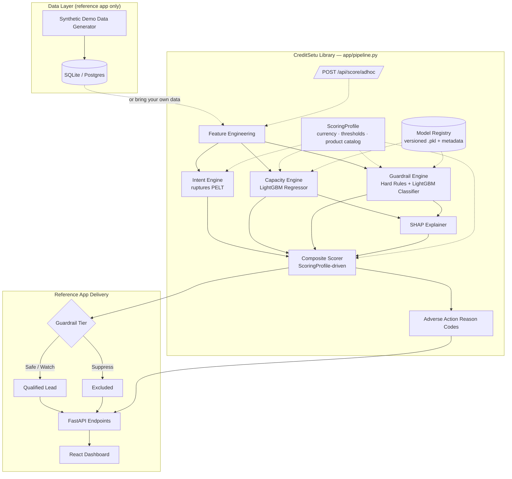
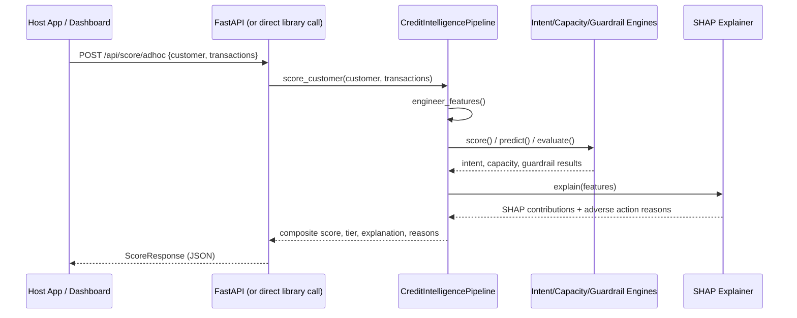

<div align="center">

# CreditSetu

### An open-source, explainable credit intelligence engine for thin-file and alternative-data lending — pip-installable, currency/policy-configurable, and built to be embedded in your own lending stack

[](LICENSE)
[](#tech-stack)
[](#tech-stack)
[](#usage--api-reference)

[**Live Dashboard**](https://credit-setu-iota.vercel.app) &nbsp;·&nbsp; [**Live API Docs**](https://creditsetu.onrender.com/docs) &nbsp;·&nbsp; [**Report an Issue**](https://github.com/adarshcod30/CreditSetu/issues)

</div>

---

CreditSetu identifies, ranks, and explains creditworthy borrowers from raw transaction data — specifically the **thin-file, new-to-credit (NTC), and gig-income segments** that bureau-only scoring can't evaluate at all. It runs three scoring engines (Intent, Capacity, Guardrail) over behavioral transaction features, explains every decision with SHAP-backed attributions and regulator-style adverse action reason codes, and ships as both a standalone reference application and a `pip install`-able Python library you can drop into your own system.

> [!NOTE]
> The live demo above runs on **synthetically generated data** — see [Validation & Limitations](#evaluation--validation) before trusting any number here operationally. The engines themselves are generic; nothing about them is specific to one bank, market, or currency (see [Using CreditSetu as a Library](#using-creditsetu-as-a-library)).

**Keywords:** `alternative-credit-scoring` `thin-file-lending` `credit-risk` `explainable-ai` `shap` `lightgbm` `account-aggregator` `fastapi` `react` `credit-scorecard` `nbfc` `fintech`

---

## Table of Contents

- [Who This Is For](#who-this-is-for)
- [Key Features](#key-features)
- [Tech Stack](#tech-stack)
- [System Architecture](#system-architecture)
- [Application / Request Flow](#application--request-flow)
- [Using CreditSetu as a Library](#using-creditsetu-as-a-library)
- [Scoring Pipeline](#scoring-pipeline)
- [Evaluation & Validation](#evaluation--validation)
- [Database Schema Reference](#database-schema-reference)
- [Deployment & Infrastructure](#deployment--infrastructure)
- [Project Structure](#project-structure)
- [Getting Started](#getting-started)
- [Usage / API Reference](#usage--api-reference)
- [Testing](#testing)
- [Roadmap](#roadmap)
- [Contributing](#contributing)
- [License](#license)
- [Contact](#contact)

---

## Who This Is For

Alternative/non-FICO credit scoring is a real and fast-growing category — roughly **$1.15–1.5B in 2025**, projected to **$4.7–11.7B by the mid-2030s** (16–23% CAGR across market definitions), with Asia-Pacific and Africa flagged as the largest opportunity because 800M+ adults there lack formal credit history.<sup>[[1]](https://market.us/report/alternative-credit-scoring-market/) [[2]](https://www.intelmarketresearch.com/alternative-credit-scoring-market-44413)</sup> CreditSetu is built for the teams operating in that space:

- **NBFCs, microfinance institutions, and digital lenders** in India, Southeast Asia, Latin America, and Africa underwriting thin-file, no-file, and gig-income borrowers — the exact segment traditional bureau scores can't serve.<sup>[[3]](https://www.yuverse.ai/resources/posts/alternate-data-sources-indian-nbfcs-credit-scoring)</sup>
- **Account Aggregator data-analytics / BRE platform builders** — an open-source, self-hostable alternative or complement to commercial layers like Perfios, FinBox BankConnect, Digitap, and Setu/Anumati, for teams that want to own their scoring stack rather than license one.<sup>[[4]](https://research.finbox.in/blog/best-account-aggregator-data-analytics-providers-india/) [[5]](https://www.perfios.com/post/account-aggregator-and-ocen-india-s-financial-inclusion-duo)</sup>
- **Embedded-finance and BNPL platforms** that need an explainable underwriting layer to white-label into a checkout or lending flow.
- **Credit unions and community/cooperative lenders** without the budget for enterprise underwriting software.
- **In-house fintech engineering teams** who want a library they `pip install` and call from their own risk stack, not another SaaS dashboard to stand up.
- **Regtech/compliance teams** that need SHAP-backed adverse action reason codes for fair-lending disclosure.
- **Credit-risk ML researchers and students** who want a reference implementation reporting industry-standard scorecard metrics (KS-statistic, Gini, PSI) — not just generic AUC/RMSE.

Globally, the same underwriting problem — score people alternative data can serve but bureaus can't — is solved commercially by Tala, Branch, and LenddoEFL across 20+ emerging-market countries.<sup>[[6]](https://lenddoefl.com/) [[7]](https://airepository.worldbank.org/use-case/tala-finance-ml-credit-scoring)</sup> CreditSetu is an open, self-hostable take on the same idea.

## Key Features

| Feature | Description |
|---|---|
| **Behavioral Credit Assessment** | Scores customers on transactional activity (income entropy, rent consistency, bounce history, EMI burden) instead of relying solely on bureau history — works even when `bureau_score` is `null`. |
| **Intent Signal Detection** | `ruptures` PELT change-point detection on daily net cash flow surfaces life events (EMI closures, income step-ups) directly from the transaction stream, not a hand-labeled campaign list. |
| **Capacity Regression** | LightGBM regressor estimating safe monthly repayment capacity; LightGBM's native missing-value handling is what makes thin-file scoring work at all. |
| **Risk Guardrail Engine** | Hard compliance rules (bounce count, active-lender count, EMI ratio) combined with a logit-calibrated LightGBM classifier, tiering every customer into **Safe / Watch / Suppress**. |
| **Explainable AI + Adverse Action Reasons** | SHAP `TreeExplainer` attributions, normalized to relative percentage impact, doubling as regulator-style "top negative factor" reason codes for decline disclosure (ECOA Reg B / RBI Fair Practices Code-style). |
| **Policy-configurable via `ScoringProfile`** | Currency, guardrail thresholds, composite weights, and the product decision table all live in one config object (YAML or code) — swap institutions/products without touching engine code. |
| **Model registry** | Versioned model artifacts with a metadata sidecar (trained-at, metrics, profile) instead of an overwritten pickle file — filesystem-based, zero new infra. |
| **`pip install`-able library** | `CreditIntelligencePipeline` is the single call a host application needs — see [Using CreditSetu as a Library](#using-creditsetu-as-a-library). |
| **Vectorized at scale** | Batch scoring builds the full feature/model matrix once instead of one model call per customer — the difference between minutes and hours at real transaction volume. |

## Tech Stack

| Layer | Technology |
|---|---|
| Scoring library | Python 3.11+, pandas, NumPy, scikit-learn, LightGBM, SHAP, ruptures, Pydantic |
| Reference API | FastAPI, Uvicorn, SQLAlchemy (SQLite by default, Postgres-ready) |
| Reference Frontend | React 18, Vite, Tailwind CSS, Recharts, React Router |
| Packaging | `pyproject.toml` (setuptools) — `pip install -e ./backend` |
| Deployment | Render (API) + Vercel (dashboard) for the demo; Docker-friendly for anything else |

## System Architecture

The scoring library (feature engineering → three engines → SHAP explainer → composite scorer) is the reusable core. The FastAPI service, SQLite/Postgres store, synthetic data generator, and React dashboard around it are a **reference application** — useful as a demo and a template, but not required to use CreditSetu as a library.


```mermaid
graph TB
    subgraph "Data Layer (reference app only)"
        A[Synthetic Demo Data Generator] --> D[(SQLite / Postgres)]
    end

    subgraph "CreditSetu Library — app/pipeline.py"
        D -.->|or bring your own data| F[Feature Engineering]
        API_ADHOC[/POST /api/score/adhoc/] -.-> F
        F --> K[Intent Engine<br/>ruptures PELT]
        F --> L[Capacity Engine<br/>LightGBM Regressor]
        F --> M[Guardrail Engine<br/>Hard Rules + LightGBM Classifier]
        K & L & M --> Q[Composite Scorer<br/>ScoringProfile-driven]
        L & M --> N[SHAP Explainer]
        N --> Q
        Q --> ADV[Adverse Action Reason Codes]
        PROFILE[ScoringProfile<br/>currency · thresholds · product catalog] -.-> K
        PROFILE -.-> L
        PROFILE -.-> M
        PROFILE -.-> Q
        REG[(Model Registry<br/>versioned .pkl + metadata)] -.-> L
        REG -.-> M
    end

    subgraph "Reference App Delivery"
        Q --> R{Guardrail Tier}
        R -->|Safe / Watch| S[Qualified Lead]
        R -->|Suppress| T[Excluded]
        S & T --> U[FastAPI Endpoints]
        ADV --> U
        U --> V[React Dashboard]
    end
```

## Application / Request Flow


```mermaid
sequenceDiagram
    participant Host as Host App / Dashboard
    participant API as FastAPI (or direct library call)
    participant Pipe as CreditIntelligencePipeline
    participant Eng as Intent/Capacity/Guardrail Engines
    participant Shap as SHAP Explainer

    Host->>API: POST /api/score/adhoc {customer, transactions}
    API->>Pipe: score_customer(customer, transactions)
    Pipe->>Pipe: engineer_features()
    Pipe->>Eng: score() / predict() / evaluate()
    Eng-->>Pipe: intent, capacity, guardrail results
    Pipe->>Shap: explain(features)
    Shap-->>Pipe: SHAP contributions + adverse action reasons
    Pipe-->>API: composite score, tier, explanation, reasons
    API-->>Host: ScoreResponse (JSON)
```

## Using CreditSetu as a Library

Install the minimal core (`pandas`, `numpy`, `scikit-learn`, `lightgbm`, `pydantic`, `pyyaml` — no FastAPI, no SQLAlchemy, no SHAP, no ruptures):

```bash
pip install -e ./backend
```

That's genuinely enough to fit and score — verified in a clean venv with nothing else installed. SHAP explainability and ruptures-based life-event detection are opt-in extras that degrade gracefully if skipped (you just get template-based explanations and no change-point events instead of an import error):

```bash
pip install -e "./backend[explain]"   # + SHAP feature attributions / adverse action reasons
pip install -e "./backend[intent]"    # + ruptures change-point life-event detection
pip install -e "./backend[full]"      # everything the reference app uses
```

```python
from app.pipeline import CreditIntelligencePipeline
from app.scoring_profile import ScoringProfile

# Swap in your own policy — currency, guardrail thresholds, product catalog —
# without touching any engine code.
profile = ScoringProfile.from_yaml("backend/profiles/generic_digital_lender.yaml")
pipeline = CreditIntelligencePipeline(profile=profile)

# Fit on your own historical data (customers_df needs `true_repayment_capacity`;
# pass a real `is_stressed` column too if you have actual default outcomes —
# see Evaluation & Validation below for why that matters).
pipeline.fit(customers_df, transactions_df)

# Score one customer...
result = pipeline.score_customer(customer, customer_transactions_df)

# ...or a whole batch, vectorized end-to-end.
scores_df = pipeline.score_batch(customers_df, transactions_df)
```

**Data contract** — `customer` is a dict needing at least `customer_id` and `bureau_score` (`None` is a first-class value, not an edge case). `transactions` is a DataFrame with `date`, `amount`, `type` (`credit`/`debit`), `category`, `counterparty`, `is_bounce`. Full details, including exactly which `category` values the feature pipeline recognizes, live in [`app/pipeline.py`](backend/app/pipeline.py)'s module docstring.

Need an engine CreditSetu doesn't ship (fraud, AML)? Register it alongside the built-ins:

```python
from app.registry import register_engine
register_engine("fraud", MyFraudEngine)
```

## Scoring Pipeline

### 1. Data Sources & Collection
The reference app ships a synthetic data generator (`app/data_generation/`) producing 6–12 months of daily transaction data per customer across 5 personas (salaried, gig worker, new-to-credit, self-employed, over-leveraged), structured to match India's Account Aggregator Deposit FI schema. This is a demo data pack, not a dependency of the scoring engines — a real deployment brings its own AA-integrated or core-banking-sourced transaction data matching the contract above.

### 2. Feature Engineering
`app/features/feature_engineering.py` computes ~19 behavioral features per customer: income mean/CV/timing regularity, a gig-income pattern score (payment frequency × counterparty diversity × amount variability), EMI-to-inflow ratio and trend, concurrent lender count, NACH bounce counts (3m/6m), rent consistency, merchant-category spending entropy, and monthly surplus. It defensively coerces types, drops duplicate `txn_id`s, and discards non-positive amounts before computing anything — real transaction feeds are messy, and this runs whether you call it via the batch demo path or a single ad-hoc API request.

### 3. Life-Event Detection
`ruptures` PELT change-point detection runs on a 30-day rolling average of net cash flow to find structural breaks, which are then classified (EMI closure / income step-up / new commitment) by inspecting the transaction stream around the breakpoint — algorithmic detection, not ground-truth lookup.

### 4. Model Training
- **Capacity Engine**: LightGBM regressor (200 estimators) predicting safe monthly repayment capacity; LightGBM's native NaN handling is what lets thin-file customers get scored at all.
- **Guardrail Engine**: hard rules (always-suppress thresholds) layered with a LightGBM classifier (150 estimators, class-imbalance-aware) predicting repayment stress probability.
- Both accept **any** `customers_df` carrying the right target column — synthetic by default, real historical outcomes when you have them (see below).

### 5. Evaluation
See [Evaluation & Validation](#evaluation--validation).

## Evaluation & Validation

### Real-data validation (non-circular)

`python scripts/validate_against_real_data.py` fits the Guardrail Engine against **[Give Me Some Credit](https://www.openml.org/search?type=data&id=45577)** — 150,000 real borrowers with real 2-year default outcomes, mirrored on OpenML with no auth required. This closes the circularity gap below: it's a genuinely held-out real dataset the engine has never seen, with a real label.

| Metric | Value |
|---|---|
| Real borrowers evaluated | 117,454 (after data-quality filtering) · real default rate 7.00% |
| AUC-ROC | **0.8214** |
| KS-statistic | 0.5179 |
| Gini coefficient | 0.6428 |

That's using only **7 of the model's 14 features** — this tabular dataset has no equivalent for income stability/timing, gig pattern, rent consistency, spending diversity, or bureau score, so those are held at a neutral constant (see the script's docstring for the exact mapping). 0.82 AUC with half the feature vector missing is a real, honest signal the underlying approach discriminates risk — not a synthetic artifact. Also used to recalibrate the synthetic guardrail formula's coefficients below (baseline default rate, delinquency weight, debt-ratio elasticity) against this dataset's actual measured effect sizes instead of hand-picked guesses.

### Synthetic benchmark (engineering regression tests, not proof of real-world accuracy)

> [!IMPORTANT]
> The default training targets (`true_repayment_capacity`, `is_stressed`) are generated by the *same formulas* used to build the training features. The numbers below are an internal consistency check — proof the models can recover a known synthetic relationship — not evidence of real-world predictive power on their own (see the real-data validation above for that). `CapacityEngine.fit()` / `GuardrailEngine.fit()` accept any `customers_df` carrying the target column, so a real deployment should retrain against its own actual historical repayment/default outcomes before trusting these numbers operationally.

Run it yourself: `python scripts/run_benchmark.py --n_customers 5000`. Sample results below are from a 2,000-customer synthetic benchmark run (`python scripts/run_benchmark.py --n_customers 2000`, ~1.57M transactions, ~99s end-to-end), including the credit-scorecard-standard metrics most generic ML benchmarks skip:

| Engine | AUC-ROC | KS-statistic | Gini | PSI (train vs. test) | Other |
|---|---|---|---|---|---|
| Capacity | 0.9896 | 0.9104 | 0.9792 | see `benchmark_report.json` | RMSE 3,611 · R² 0.9013 |
| Guardrail | 0.8414 | 0.5906 | 0.6828 | see `benchmark_report.json` | FPR 13.7% · FNR 28.2% |
| Intent | — | — | — | — | Precision 0.330 · Recall 0.448 · F1 0.380 |
| Composite | — | — | — | — | Precision@Top20% 1.00 · avg latency 23.4ms/customer |

Note the Guardrail engine's synthetic AUC (0.84) now lands close to its real-data AUC (0.82) above — a reassuring consistency check after calibrating the synthetic formula's coefficients against real elasticities, rather than a coincidence to read too much into.

KS-statistic, Gini coefficient, and Population Stability Index (PSI) are computed in [`app/evaluation/metrics.py`](backend/app/evaluation/metrics.py) — the three metrics real credit scorecards are actually judged on, not just generic AUC-ROC.

## Database Schema Reference

The reference app's demo database (SQLAlchemy ORM, `app/models/`) has three tables:

| Table | Purpose |
|---|---|
| `customers` | Demographics, persona type, bureau score (nullable — NTC indicator), ground-truth validation fields |
| `transactions` | Daily AA-style ledger entries: amount, type, category, counterparty, channel, bounce flag |
| `scores` | Composite score, sub-scores, guardrail tier + reasons, SHAP contributions, **adverse action reasons**, suggested product |

Full column-level detail is in [`app/models/`](backend/app/models/) and the auto-generated schema at `/docs` once the API is running.

## Deployment & Infrastructure

- **API**: deployed on [Render](https://creditsetu.onrender.com) — `uvicorn app.main:app`, SQLite by default (`DATABASE_URL` swaps to Postgres with no code change, see [`app/database.py`](backend/app/database.py)).
- **Dashboard**: deployed on [Vercel](https://credit-setu-iota.vercel.app) — static Vite build, `VITE_API_URL` / `VITE_BRAND_NAME` env-configurable.
- **Environments**: local dev uses `.env` (see `.env.example`); production uses the hosting provider's env var configuration.
- **Scaling**: batch scoring is vectorized (one model call per batch, not per customer) — see `CompositeScorer.score_batch()`, `CapacityEngine.predict_batch()`, `GuardrailEngine.evaluate_batch()`. For real transaction volume beyond a single SQLite file, point `DATABASE_URL` at Postgres.
- **Model artifacts**: versioned via the filesystem-based registry in [`app/model_registry.py`](backend/app/model_registry.py) — swap for an MLflow/S3-backed registry in a larger deployment without touching the engines that call it.

## Project Structure

```
CreditSetu/
├── README.md
├── LICENSE
├── .env.example
├── backend/
│   ├── pyproject.toml           # pip install -e . — the library packaging
│   ├── requirements.txt         # reference app dependencies
│   ├── profiles/                # example ScoringProfile YAML files
│   ├── scripts/
│   │   ├── seed_database.py     # demo DB seeding script
│   │   ├── run_benchmark.py     # synthetic-data evaluation runner
│   │   └── validate_against_real_data.py  # ★ real-data (non-circular) validation
│   ├── app/
│   │   ├── main.py              # FastAPI reference app entry point
│   │   ├── pipeline.py          # ★ CreditIntelligencePipeline — the library entry point
│   │   ├── scoring_profile.py   # ★ ScoringProfile — policy/currency/threshold config
│   │   ├── model_registry.py    # ★ versioned model artifact storage
│   │   ├── registry.py          # ★ pluggable engine registry
│   │   ├── database.py, config.py
│   │   ├── models/, schemas/    # SQLAlchemy ORM + Pydantic schemas
│   │   ├── data_generation/     # synthetic demo data pack (not a library dependency)
│   │   ├── features/            # feature engineering
│   │   ├── engines/             # Intent, Capacity, Guardrail engines + base classes
│   │   ├── explainability/      # SHAP + adverse action reasons
│   │   ├── evaluation/          # benchmark runner + KS/Gini/PSI metrics
│   │   └── api/                 # FastAPI route files
│   └── tests/
└── frontend/
    ├── src/
    │   ├── App.jsx               # brand-configurable nav/shell
    │   ├── pages/                # Lead Dashboard, Customer Detail, Benchmarks, Data Engine
    │   ├── components/
    │   └── api/client.js
    └── package.json
```

## Getting Started

### Prerequisites
- Python 3.11+
- Node 18+ (for the reference dashboard)

### Backend (library + reference API)

```bash
git clone https://github.com/adarshcod30/CreditSetu.git
cd CreditSetu/backend

python3 -m venv .venv
source .venv/bin/activate
pip install -r requirements.txt          # reference app
# or: pip install -e .                   # library only, no FastAPI/SQLAlchemy

python scripts/seed_database.py --n_customers 1000   # generates data, trains models, scores
uvicorn app.main:app --port 8000 --reload
```

### Frontend (reference dashboard)

```bash
cd frontend
npm install
npm run dev
```

Open `http://localhost:5173`. Optionally set `VITE_BRAND_NAME` to reskin the dashboard header/footer for your own org.

## Usage / API Reference

Interactive Swagger docs are always available at `/docs` once the API is running.

| Method | Endpoint | Description |
|---|---|---|
| `GET` | `/api/leads` | Ranked, filterable, paginated lead list |
| `GET` | `/api/score/{customer_id}` | Full score breakdown + SHAP + adverse action reasons for a seeded customer |
| `POST` | **`/api/score/adhoc`** | Score a customer's transactions directly in the request body — the bring-your-own-data path |
| `POST` | `/api/data/generate` | Regenerate the synthetic demo dataset and retrain models |
| `GET` | `/api/customers`, `/api/customers/db-stats/summary` | Customer listing and dataset summary stats |
| `POST` / `GET` | `/api/benchmark/run`, `/api/benchmark/latest` | Trigger/fetch the evaluation report (KS/Gini/PSI included) |

```bash
curl -X POST https://creditsetu.onrender.com/api/score/adhoc \
  -H "Content-Type: application/json" \
  -d '{
        "customer": {"customer_id": "EXT-001", "bureau_score": null},
        "transactions": [
          {"date": "2024-01-05", "amount": 45000, "type": "credit", "category": "salary", "counterparty": "employer.co", "is_bounce": false},
          {"date": "2024-01-10", "amount": 12000, "type": "debit", "category": "rent", "counterparty": "landlord", "is_bounce": false}
        ]
      }'
```

## Testing

```bash
cd backend
pytest
```

69+ tests across engine correctness (score ranges, tier assignment, batch-vs-single-row parity), synthetic data generation, feature-engineering edge cases (empty/single-transaction customers, duplicate `txn_id`, negative amounts, unparsed/mixed-case input), the model registry, `ScoringProfile` swapping, and the KS/Gini/PSI metric implementations.

## Roadmap

- [x] Real-dataset validation harness (`scripts/validate_against_real_data.py`, see [Evaluation & Validation](#evaluation--validation))
- [ ] Expand real-data validation to a dataset with transaction-level granularity, closing the 7/14-feature gap
- [ ] Pluggable feature store interface for streaming/online feature computation
- [ ] Additional example `ScoringProfile`s for more market/product combinations
- [ ] Optional MLflow-backed model registry adapter
- [ ] Fraud/AML example engine built on the `registry.py` extension point

See [open issues](https://github.com/adarshcod30/CreditSetu/issues) for the full list.

## Contributing

Contributions are welcome.

1. Fork the project
2. Create your feature branch (`git checkout -b feature/your-feature`)
3. Commit your changes with clear messages
4. Push and open a PR

## License

Distributed under the MIT License. See [`LICENSE`](LICENSE) for details.

## Contact

Adarsh — [23ucs509@lnmiit.ac.in](mailto:23ucs509@lnmiit.ac.in) — [github.com/adarshcod30](https://github.com/adarshcod30)

Project link: [github.com/adarshcod30/CreditSetu](https://github.com/adarshcod30/CreditSetu)

---

### Sources
1. [Alternative Credit Scoring Market — market.us](https://market.us/report/alternative-credit-scoring-market/)
2. [Alternative Credit Scoring (Non-FICO) Market — intelmarketresearch.com](https://www.intelmarketresearch.com/alternative-credit-scoring-market-44413)
3. [Alternate Data Sources Indian NBFCs Use for Credit Scoring — YuVerse](https://www.yuverse.ai/resources/posts/alternate-data-sources-indian-nbfcs-credit-scoring)
4. [Best Account Aggregator Data Analytics Providers in India — FinBox Research](https://research.finbox.in/blog/best-account-aggregator-data-analytics-providers-india/)
5. [Account Aggregator & OCEN — Perfios](https://www.perfios.com/post/account-aggregator-and-ocen-india-s-financial-inclusion-duo)
6. [LenddoEFL](https://lenddoefl.com/)
7. [Tala Finance: ML for Credit Scoring — World Bank AI Repository](https://airepository.worldbank.org/use-case/tala-finance-ml-credit-scoring)
8. [Give Me Some Credit dataset — OpenML mirror](https://www.openml.org/search?type=data&id=45577), of the [Kaggle competition](https://www.kaggle.com/c/GiveMeSomeCredit) — used for real-data validation and guardrail coefficient calibration
